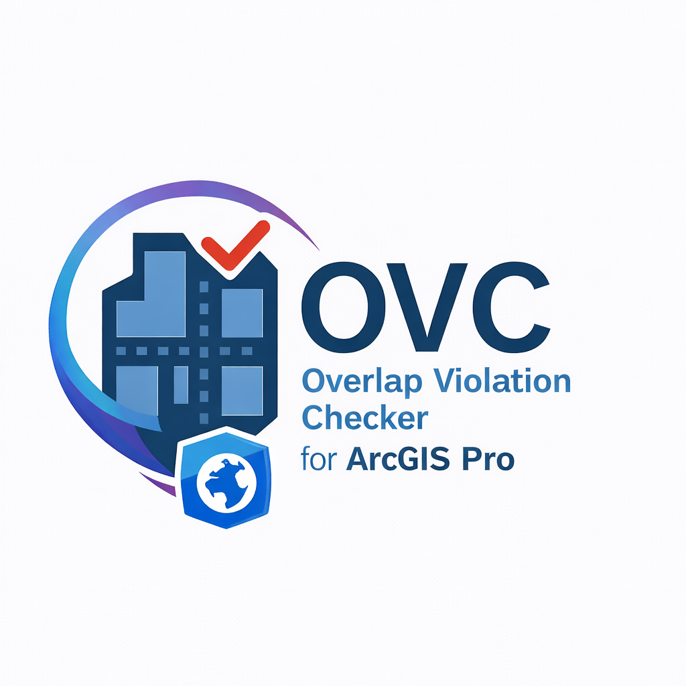
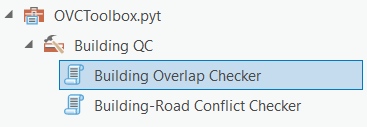
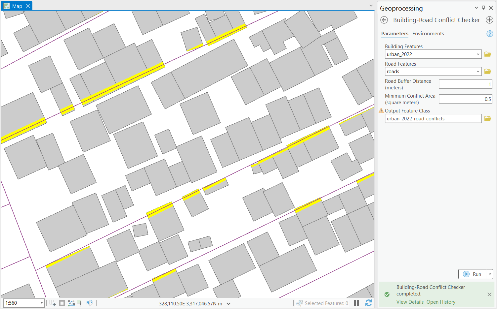

<p align="center">
  
</p>

# OVC – Overlap Violation Checker for ArcGIS Pro

A production-ready ArcGIS Pro Python Toolbox for detecting spatial conflicts and topology issues in vector datasets.

[](https://www.esri.com/en-us/arcgis/products/arcgis-pro)
[](https://www.python.org/)
[](LICENSE)

## Overview

OVC (Overlap Violation Checker) is a native ArcGIS Pro quality control toolbox designed to detect spatial conflicts in building and road datasets. It operates entirely within ArcGIS Pro using only ArcPy—no external dependencies or data downloads required.

**Target Audience:** GIS professionals in government, utilities, and consulting who need reliable spatial QC workflows.

## Key Features

- **Building Overlap Detection** – Identifies overlapping polygons with classification (duplicate, partial, sliver)
- **Building-Road Conflict Detection** – Finds buildings that encroach on road buffers
- **Automatic Coordinate System Handling** – Auto-projects geographic data to UTM for accurate area calculations
- **Spatial Indexing** – Grid-based optimization for performance with large datasets
- **Native ArcGIS Pro Integration** – Runs in background, supports selections, auto-adds results to map

## Supported Versions

| Component | Version |
|-----------|---------|
| ArcGIS Pro | 3.0+ |
| Python | 3.9+ (ArcGIS Pro's bundled environment) |
| License Level | Basic, Standard, or Advanced |

## Installation

1. **Download** or clone this repository:
   ```
   git clone https://github.com/AmmarYasser455/ovc-arcgis-pro.git
   ```

2. **Add the toolbox** to ArcGIS Pro:
   - Open ArcGIS Pro
   - In the Catalog pane, right-click **Toolboxes**
   - Select **Add Toolbox**
   - Navigate to `OVCToolbox.pyt` and click **OK**

3. **Run tools** from the Geoprocessing pane under **Overlap Violation Checker**

## Toolbox Contents



| Tool | Category | Description |
|------|----------|-------------|
| Building Overlap Checker | Building QC | Detects overlapping polygons and classifies by severity |
| Building-Road Conflict Checker | Building QC | Finds buildings within road buffer zones |

## Basic Usage

### Building Overlap Checker

1. Open the tool from the Geoprocessing pane
2. Select your **building polygon layer** as input
3. Set **minimum overlap area** threshold (default: 1.0 m²)
4. Specify an **output feature class** location
5. Run the tool

**Output:** Polygon features representing overlap areas with attributes:
- `SOURCE_FID_A`, `SOURCE_FID_B` – Original feature IDs
- `OVERLAP_AREA_M2` – Overlap area in square meters
- `OVERLAP_RATIO` – Proportion of smaller feature covered
- `OVERLAP_TYPE` – Classification (DUPLICATE, PARTIAL, SLIVER)


### Building-Road Conflict Checker

1. Select your **building layer** (polygons)
2. Select your **road layer** (polylines)
3. Set **buffer distance** around roads (default: 5.0 m)
4. Specify an **output feature class** location
5. Run the tool

**Output:** Polygon features representing conflict areas with attributes:
- `BUILDING_FID`, `ROAD_FID` – Original feature IDs
- `CONFLICT_AREA_M2` – Conflict area in square meters
- `BUFFER_DIST_M` – Buffer distance used



## Repository Structure

```
ovc-arcgis-pro/
├── OVCToolbox.pyt          # Main Python Toolbox file
├── README.md               # This file
├── TOOL_USAGE.md           # Detailed usage guide
├── ARCHITECTURE.md         # Technical documentation
├── LICENSE                 # License file
├── core/                   # Core processing modules
│   ├── config.py           # Configuration and thresholds
│   ├── geometry.py         # Geometry utilities
│   └── spatial_ops.py      # Spatial index and operations
├── checks/                 # QC check implementations
│   ├── building_overlap.py
│   └── building_road_conflict.py
└── utils/                  # Helper utilities
    ├── cursor_helpers.py   # Data access functions
    └── messaging.py        # Progress and logging
```

## Performance

| Dataset Size | Building Overlap | Building-Road Conflict |
|--------------|------------------|------------------------|
| 5,000 features | ~30 seconds | ~1 minute |
| 50,000 features | ~5 minutes | ~10 minutes |

Performance depends on data density and overlap frequency. Spatial indexing reduces processing time significantly for large datasets.

## Known Limitations

- **Topology rules not replaced** – This tool detects violations but does not enforce topology; use ArcGIS topology for enforcement
- **Memory constraints** – Very large datasets (500k+ features) may require chunking
- **Projection accuracy** – Auto-projection uses UTM zones; for polar regions, manual projection may be more appropriate
- **Road types** – All roads are buffered equally; custom buffering by road class requires preprocessing

## Requirements

- ArcGIS Pro 3.0 or later
- No additional Python packages required (uses only ArcPy)
- No external data downloads

## License

This project is licensed under the MIT License. See [LICENSE](LICENSE) for details.

## Author

**Ammar Yasser Abdalazim**  
GIS Developer / Spatial Data Engineer

Focus Areas:
- GIS quality control tools
- Spatial data validation
- Python-based GIS automation
- ArcGIS Pro and open-source GIS workflows

## Repository

This project is maintained on GitHub at:  
**https://github.com/AmmarYasser455/ovc-arcgis-pro**

---

*OVC – Overlap Violation Checker is developed to support professional GIS quality control workflows.*
